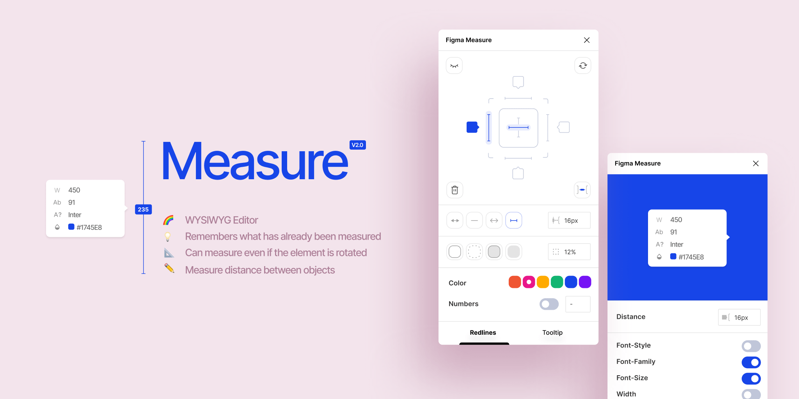
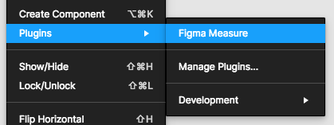

# Figma Measure



A plugin to add measurement lines to figma.

You can find it here: https://www.figma.com/community/plugin/739918456607459153/Figma-Measure

### Preview


### How to use?

- Open Figma
- Go to **Plugins**
- Click on **Browse all plugins**.
- Search for **Figma Measure** and click install
- Ready!

You can now find this plugin in the **Plugins** section by right-clicking on your project.



Clicking **Figma Measure** opens a window.
Now you can select one or more elements and click on the different alignments to add red lines.
At the bottom you can set the arrow style.

Feel free to open a feature request: https://github.com/ph1p/figma-measure/issues

### Development

```bash
git clone git@github.com:ph1p/figma-measure.git
cd figma-measure
npm install
```

```bash
npm run build
```

or

```bash
npm run dev
```

- Open figma
- Go to **Plugins**
- Click the "+" next to **Development**
- Choose the manifest.json inside `figma-measure/Figma Measure`
- Ready to develop

