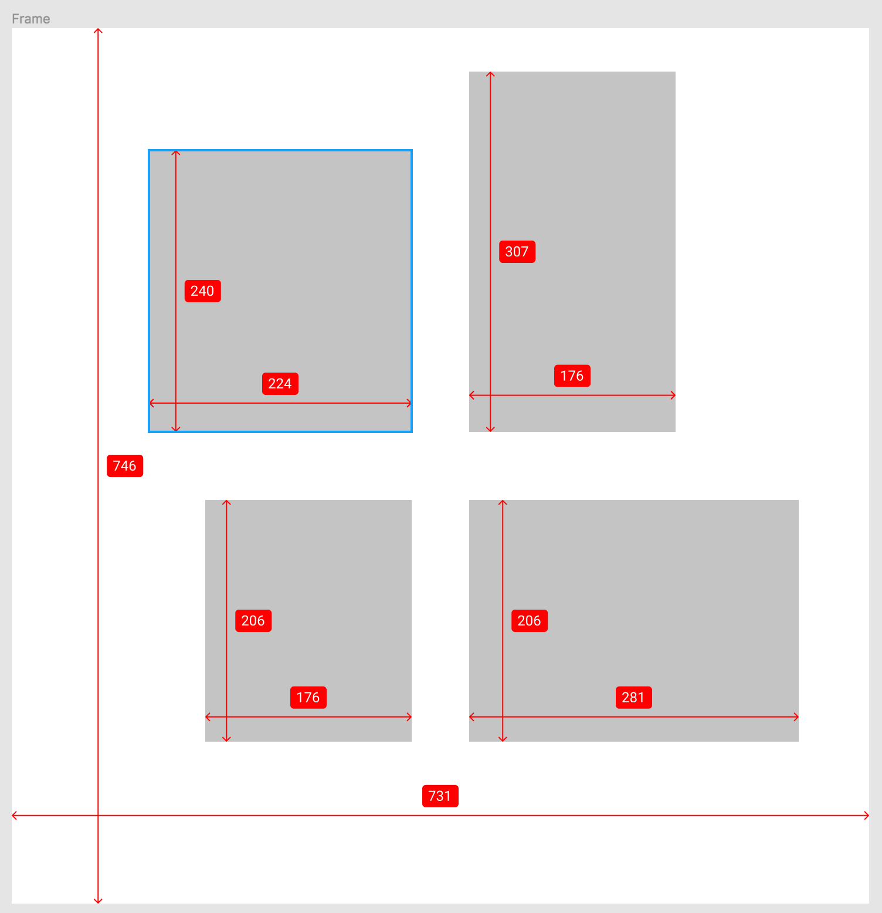

# figma-measure



A plugin to add measurement lines to figma.

### How to use?

This plugin is not official released and **under development**! But if you want to use it, feel free to download the zip from [https://github.com/ph1p/figma-measure/releases](https://github.com/ph1p/figma-measure/releases).

* Unzip it and open figma
* Go to **Plugins**
* Click the "+" next to **Development**
* Choose the manifest.json inside `figma-measure`
* Ready!

### Todo

- [x] Create boxes with measurement
- [x] Measure height and width
- [ ] Name groups
- [ ] Add a small UI to change some settings
- [ ] Line alignment
- [x] Text alignment
- [ ] Measure external distance
- [ ] Add dashed help lines
- [ ] Add multiple files to structure code
...


### Development

```bash
npm install
```

```bash
npm run build
```

```bash
npm run dev
```