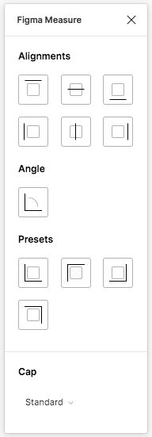

 # figma-measure


A plugin to add measurement lines to figma.

### How to use?

* Open Figma
* Go to **Plugins**
* Click on **Browse all plugins**.
* Search for **Figma Measure** and click install
* Ready!

You can now find this plugin in the **Plugins** section by right-clicking on your project.


Clicking **Figma Measure** opens a window.
Now you can select one or more elements and click on the different alignments to add red lines.
At the bottom you can set the arrow style.




### Todolist/Featurelist

- [x] Create boxes with measurement
- [x] Measure height and width
- [x] Name groups
- [x] Add a small UI
- [x] Line alignment
- [x] Text alignment
- [ ] Measure external distance
- [ ] Add dashed help lines
- [ ] Add multiple files to structure code
- [ ] Add presets (e. g. top, left)
- [ ] Save settings in Storage
- [ ] Show and hide all measurements
- [ ] Better resizing
- [ ] Collapse Groups
- [ ] Show typo specific informations

Feel free to open a feature request: https://github.com/ph1p/figma-measure/issues

### Development

```bash
git clone git@github.com:ph1p/figma-measure.git
cd figma-measure
npm install
```

```bash
npm run build
```
or

```bash
npm run dev
```

* Open figma
* Go to **Plugins**
* Click the "+" next to **Development**
* Choose the manifest.json inside `figma-measure/Figma Measure`
* Ready to develop